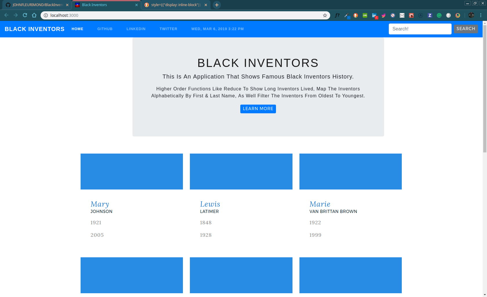

# 🔢 Black Inventors Application


### What it should look like:


## How It's Made
React, Bootstrap, and Moment.js.

## CSS~
This application is made with Pattern fleet library which made styling more easy, I used flex box to move the indivdual elements by itself. I had a code challenge last week for a job and saw what I lacked in, which was time effeciency. I was just taking to long to write the code. Dealing with the box model in css, after leaving the Resilient coders bootcamp, I got real aquianted with Bootstrap/Pattern Fleet library for City of Boston. They had their own styling guide so I didnt have to worry about the style just had to worry about the functionality of the comonents in React and what were the data types I was dealing with.

## Javascript~

```
 {Data.map((dataDetail, index) => {
          return (
            <a href='/' className='cd m-t500 g--4 g--4--sl'>
              <div className='cd-ic' style={{ backgroundImage: "url()" }} />
              <div className='cd-c'>
                <div className='cd-t'>{dataDetail.first}</div>
                <div className='cd-st t--upper t--subtitle'>
                  {dataDetail.last}
                </div>
                <div className='cd-d'>{dataDetail.year}</div>
                <div className='cd-d'>{dataDetail.passed}</div>
              </div>
            </a>
          );
        })}
```


## Optimizations.
I have a bunch of styling to do as you can see in the picture above, I would like three or four boxes across displaying the cards of the Inventors. As well have a pop-up modal showing a bio.

## Lessons Learned:
I learned how to display JSON data on the screen.

## portfolio:
[]("https:/johnfleurimond.com")

## Available Scripts

 Once you clone this repo, `cd` In the project directory, you can run:

## Installation

2. run `npm install`

## Usage

3. run `npm start`

### `npm start`

Runs the app in the development mode.<br>
Open [http://localhost:3000](http://localhost:3000) to view it in the browser.

The page will reload if you make edits.<br>
You will also see any lint errors in the console.

### `npm test`

Launches the test runner in the interactive watch mode.<br>
See the section about [running tests](https://facebook.github.io/create-react-app/docs/running-tests) for more information.

### `npm run build`

Builds the app for production to the `build` folder.<br>
It correctly bundles React in production mode and optimizes the build for the best performance.

The build is minified and the filenames include the hashes.<br>
Your app is ready to be deployed!

See the section about [deployment](https://facebook.github.io/create-react-app/docs/deployment) for more information.

### `npm run eject`

**Note: this is a one-way operation. Once you `eject`, you can’t go back!**

If you aren’t satisfied with the build tool and configuration choices, you can `eject` at any time. This command will remove the single build dependency from your project.

Instead, it will copy all the configuration files and the transitive dependencies (Webpack, Babel, ESLint, etc) right into your project so you have full control over them. All of the commands except `eject` will still work, but they will point to the copied scripts so you can tweak them. At this point you’re on your own.

You don’t have to ever use `eject`. The curated feature set is suitable for small and middle deployments, and you shouldn’t feel obligated to use this feature. However we understand that this tool wouldn’t be useful if you couldn’t customize it when you are ready for it.

## Learn More


## portfolio:

**WEBSITE:** https:johnfleurimond.com


## Happy Coding!!!!

